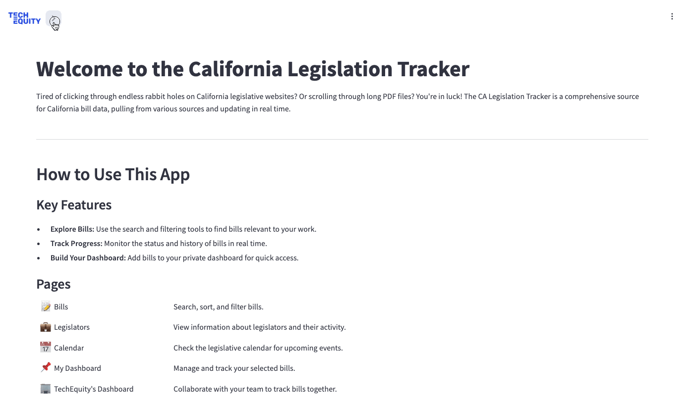

# CA Legislation Tracker
The California Legislation Tracker is a web application built with Streamlit and PostgreSQL that aggregates and displays live bill data from multiple sources all in one place, making it easier and quicker for users to access the information they need for their advocacy work.

### Key features
- **Live Data Updates**: Automatically collects and displays California legislative data, sourced from LegInfo websites and the OpenStates API, and updates in real time.
- **Centralized Information Hub**: Consolidated bill data in one platform, limiting the need to search across disparate sources.
- **Advanced Search & Filters**: Search and filter data by various fields in order to more easily find specific bill information.
- **Bill Tracking**: Track your organization's advocacy work through auto-generated fields and custom data entry.




## For Developers

### Prerequisites
Before you begin, ensure you have the following installed on your system:

- [Docker](https://docs.docker.com/get-docker/)
- [Docker Compose](https://docs.docker.com/compose/)
- [Git](https://git-scm.com/) (for cloning the repository)

### Tech Stack
- Frontend: Streamlit
- Database: PostgreSQL
- Deployment: Docker (can also be deployed with Streamlit Cloud)

### Installation

1. Clone the repository
```
git clone https://github.com/your-org/legislation-tracker.git
cd legislation-tracker/app
```

2. Set up environment
Locally configure a credentials.ini file. For example:

```
[openstates]
api_key = **********

[postgresql]
user = *********
password = *********
host = *********.db.ondigitalocean.com
port = *********
dbname = *********
sslmode = require

[postgresql_schemas]
openstates_schema = *******
legtracker_schema = *****
frontend_user = ******
backend_user = ******

```
*Note: Database scripts are currently housed in another [repository](https://github.com/techequitycollaborative/ca-leg-tracker).*

3. Install dependencies
```
pip install -r requirements.txt
```

4. Run the app
```
streamlit run main.py
```

### Folder Structure
```
app/
├── main.py                  # Entry point for Streamlit
├── pages                    # Pages are listed in app/ as individual Python files
├── utils/                   # Reusable utility functions
├── db/                      # Database sql scripts and query functions
├── data/                    # Example data + legislative calendar event data
├── styles/                  # Custom CSS for specific pages
├── archived_pages/          # Deprecated pages; not active in the app
├── requirements.txt
├── README.md
└── .ini
```
